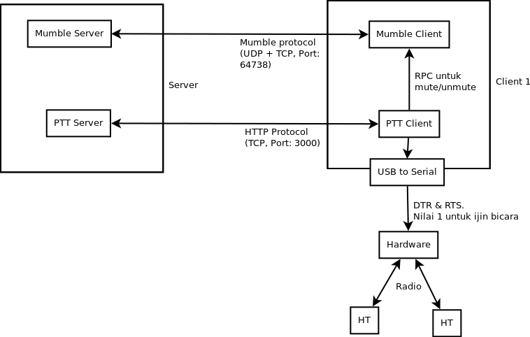
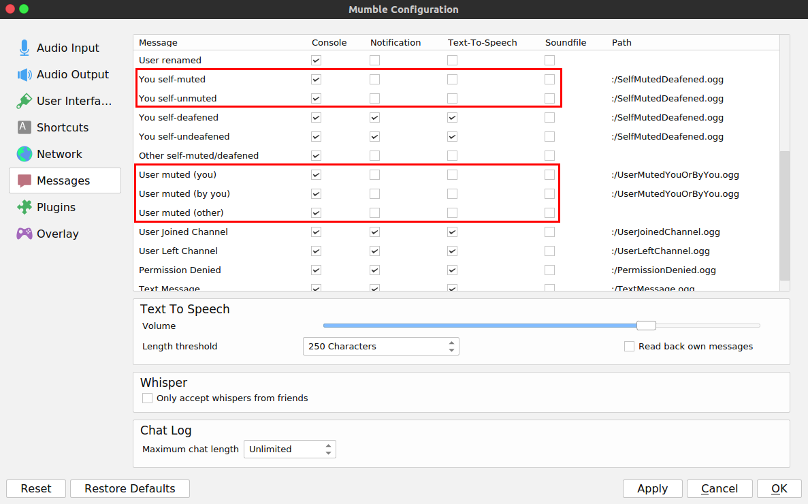

# PTT Server and Client for Mumble

Tujuan project ini adalah memberi tambahan fitur PTT (Push to Talk) di Mumble

# System Diagram

# Serial Port Datasheet

# Setup Instruction for Server and Client

* Install Ubuntu
* Untuk menginstall mumble, jalankan perintah-perintah berikut di command line (butuh koneksi internet): 
    - `sudo add-apt-repository ppa:mumble/snapshot` <-- Menambahkan respository mumble terbaru agar dikenali ubuntu
    - `sudo apt-get update` <-- Memerintahkan ubuntu untuk mengupdate repository
    - `sudo apt-get install mumble-server mumble` <-- menginstall mumber server dan mumble client
    - `sudo apt-get install sox` <-- butuh sox untuk handling audio
* Install Node.Js (butuh koneksi internet) <-- Node.Js dibutuhkan untuk menjalankan PTT Server
    - `sudo apt-get install nodejs`
    - `sudo apt-get install nodejs-legacy`
    - `sudo apt-get install build-essential`
* Download repository ini (https://github.com/goFrendiAsgard/mumble-ptt/archive/master.zip)
* Install dependency (hanya jika folder `node_modules` kosong)
    - `npm install --save --build-from-source`

# Setup Instruction for Server

* Jalankan Mumble Server (biasanya secara otomatis sudah jalan di startup)
* Cari IP server, dengan cara menjalankan perintah `ifconfig` 
* Jalankan PTT Server
    - Extract/unzip repository ini
    - Pindah ke direktori tempat repository diextract (contoh: `cd ~/Downloads/mumble-ptt-master`) 
    - Jalankan perintah `node server.js` untuk menjalankan PTT Server. Jangan tutup terminal.
* Untuk mematikan PTT Server, tekan `ctrl+c`

# Setup Instruction for Client
* Jalankan Mumble Client
* Koneksikan ke Mumble Server berdasarkan IP milik Server
* Koneksikan USB to Serial
* Jalankan PTT Client
    - Extract/unzip repository ini
    - Pindah ke direktori tempat repository diextract (contoh: `cd ~/Downloads/mumble-ptt-master`) 
    - Jalankan perintah `node client.js [device] [id-client] [http://ip-server:3000]` untuk menjalankan PTT Client. Jangan tutup terminal.
    - `device` merupakan alamat port USB, biasanya `/dev/ttyACM0` atau `/dev/ttyUSB0`. Untuk memastikan, unplug dan plug kabel USB, lalu jalankan perintah `dmesg`
* Untuk mematikan PTT Client, tekan `ctrl+c`

## Keterangan
* PTT Client memiliki 3 parameter
    - `device` merupakan alamat port USB, biasanya `/dev/ttyACM0`. Untuk memastikan, unplug dan plug kabel USB, lalu jalankan perintah `dmesg`
    - `id-client` harus berbeda untuk setiap client, bisa diberi nilai berupa kombinasi huruf dan angka tanpa spasi dan tanda baca.
    - `url` diisi dengan http + IP Server.

# Setup Instruction for Client (keyboard)
* Jalankan Mumble Client
* Koneksikan ke Mumble Server berdasarkan IP milik Server
* Jalankan PTT Client (keyboard)
    - Extract/unzip repository ini
    - Pindah ke direktori tempat repository diextract (contoh: `cd ~/Downloads/mumble-ptt-master`) 
    - Jalankan perintah `node client-keyboard.js [id-client] [http://ip-server:3000]` untuk menjalankan PTT Client. Jangan tutup terminal.
* Untuk mematikan PTT Client, tekan `ctrl+c`

# Setup Instruction for Client (interfaceless)
* Jalankan Mumble Client
* Koneksikan ke Mumble Server berdasarkan IP milik Server
* Setting mumble client seperti berikut

    

* Jalankan PTT Client (keyboard)
    - Extract/unzip repository ini
    - Pindah ke direktori tempat repository diextract (contoh: `cd ~/Downloads/mumble-ptt-master`) 
    - Jalankan perintah `node client-interfaceless.js [id-client] [http://ip-server:3000]` untuk menjalankan PTT Client. Jangan tutup terminal.
* Untuk mematikan PTT Client, tekan `ctrl+c`
